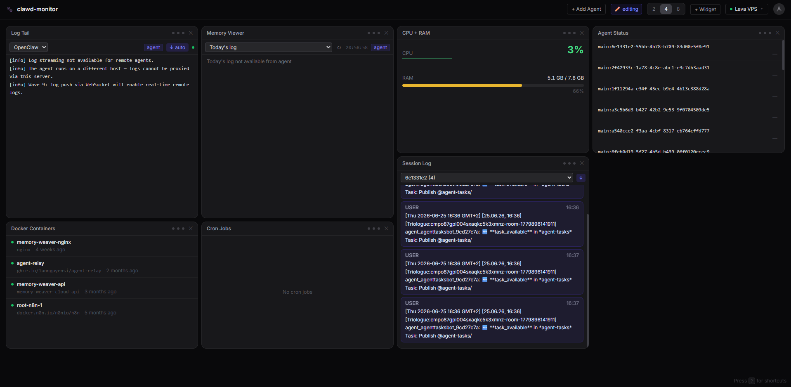

# clawd-monitor

Monitoring dashboard for [OpenClaw](https://openclaw.ai) instances.


## Overview

clawd-monitor is a Next.js dashboard that shows live status for one or more
OpenClaw hosts: sessions, memory files, cron jobs, Docker containers, and log
tails. Each host runs the companion
[clawd-monitor-agent](https://github.com/LanNguyenSi/clawd-monitor-agent),
which pushes a snapshot over WebSocket every 5 seconds; no inbound port is
required on the agent host. A widget grid renders the latest snapshot per
agent, with a switcher to move between connected agents.



## Key Features

- Live CPU/RAM, session, and agent-status widgets fed by agent push, no
  polling required.
- Connected-agent list with online/offline status and per-agent switching.
- Memory viewer, cron jobs, Docker containers, and log tail widgets.
- GitHub PR widget with CI status, and service-health checks for configured
  endpoints.
- Alert history and heartbeat pulse for agent health.
- Drag/resize/close widget layout, dark mode, and keyboard shortcuts.

See [docs/widgets.md](docs/widgets.md) for the full widget list and
shortcuts.

## Quick Start

### 1. Run clawd-monitor (server)

```bash
git clone https://github.com/LanNguyenSi/clawd-monitor
cd clawd-monitor
cp .env.example .env
# edit .env: set ADMIN_PASSWORD, JWT_SECRET

docker compose -f docker-compose.traefik.yml up -d
```

Open `https://your-domain/` and sign in with the admin password from `.env`.
After the first login, use `Settings` in the UI to change the admin
password, then generate an agent token there too.

### 2. Connect an agent

On each OpenClaw host to monitor:

```bash
npm install -g clawd-monitor-agent
clawd-monitor-agent \
  --server https://your-clawd-monitor-domain \
  --token <token-from-settings> \
  --name "My OpenClaw Host" \
  --gateway http://localhost:9500
```

Or copy the install snippet directly from the Settings page.

## Usage

Agents authenticate with the token issued from Settings and start pushing
snapshots immediately; no server restart is required. Widgets pick up the
new agent as soon as its first snapshot arrives, and the navbar switcher
lets you move between all currently connected agents.

## Documentation

- [docs/widgets.md](docs/widgets.md): widget reference and keyboard
  shortcuts.
- [docs/configuration.md](docs/configuration.md): environment variables and
  how the admin password is resolved.
- [docs/ARCHITECTURE.md](docs/ARCHITECTURE.md): data paths, key design
  decisions, and directory structure.
- [docs/AGENT-PROTOCOL.md](docs/AGENT-PROTOCOL.md): the agent WebSocket
  message format.
- [docs/SPEC-GATEWAY.md](docs/SPEC-GATEWAY.md): the original design spec for
  the agent-push model (historical; the code is authoritative where they
  differ).
- [docs/development.md](docs/development.md): npm scripts and make targets.

## Development and Contributing

```bash
npm install
cp .env.example .env.local
npm run dev
```

See [CONTRIBUTING.md](CONTRIBUTING.md) for the full setup, project
structure, and pull request checklist, and
[docs/development.md](docs/development.md) for the npm scripts and make
targets.

## License

MIT, see [LICENSE](LICENSE).
